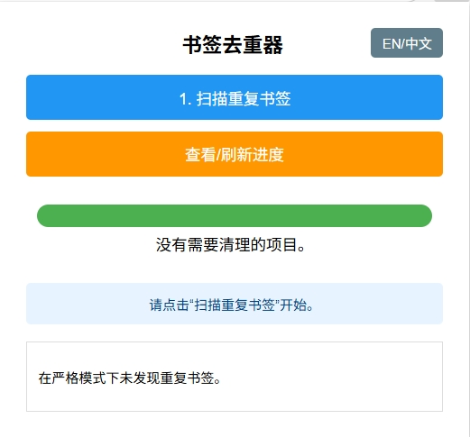
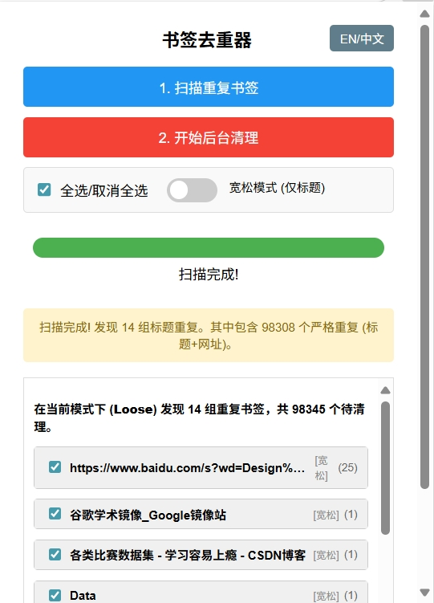
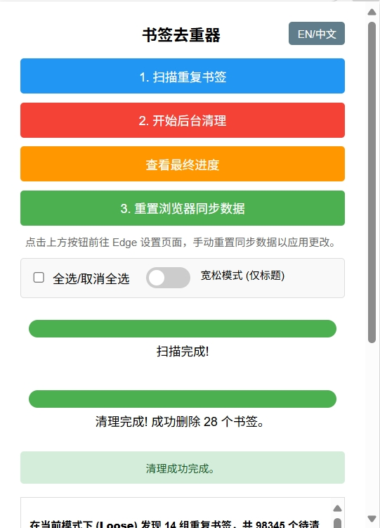
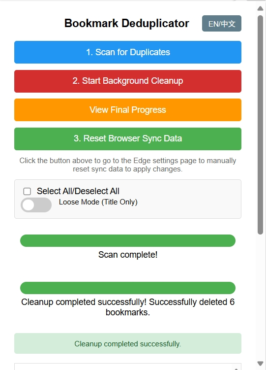

# 📚 Bookmark Deduplicator

一款轻量高效的浏览器扩展，帮助你**扫描并删除浏览器中重复的书签**，保持书签栏整洁有序。支持按名称或名称+网址匹配，后台运行不卡顿，操作直观，一键清理！

A lightweight and efficient browser extension that helps you **scan and remove duplicate bookmarks**, keeping your bookmark bar clean and organized. Supports matching by name only or name + URL, runs smoothly in the background, and offers an intuitive one-click cleanup experience!

✨ 支持 Microsoft Edge / Google Chrome 及其他基于 Chromium 的浏览器。

Compatible with Microsoft Edge / Google Chrome and other Chromium-based browsers.

[](LICENSE)
[](https://chrome.google.com/webstore/detail/YOUR_EXTENSION_ID)
[](https://microsoftedge.microsoft.com/addons/detail/%E4%B9%A6%E7%AD%BE%E5%8E%BB%E9%87%8D%E5%B7%A5%E5%85%B7-%E8%BD%BB%E9%87%8F%E9%AB%98%E6%95%88%E6%B8%85%E7%90%86%E9%87%8D%E5%A4%8D%E4%B9%A6%E7%AD%BE/iockbhndobjnencflhcnddlbamgpdloj)

---

## 🌐 语言切换 | Language Toggle

<details>
  <summary>🇨🇳 中文说明</summary>

  ## 🔍 功能特性
  - ✅ **智能去重**：可选择按“书签名”或“书签名 + 网址”识别重复项
  - ⚙️ **后台运行**：扫描时不阻塞浏览器，支持实时进度条
  - 🛑 **随时停止**：提供“停止”按钮，可中断扫描过程
  - 📁 **支持折叠文件夹**：保留原有书签结构，不打乱分组
  - ✔️ **选择性清理**：扫描完成后可勾选要删除的重复项
  - 🎛️ **筛选开关**：灵活控制哪些文件夹参与扫描
  - 📊 **优化的摘要显示**：清晰展示重复组统计信息，一目了然

  ## 🚀 安装方法
  ### 方法一：从官方商店安装
  👉 [Chrome webstore 商店](https://chromewebstore.google.com/?hl=zh-CN&authuser=0)（搜索 "Bookmark Deduplicator"）
  👉 [Edge Add-ons 商店](https://microsoftedge.microsoft.com/addons/)（搜索 "Bookmark Deduplicator"）

  ### 方法二：从本地加载（开发者模式）
  1. 克隆或下载本仓库：
     ```bash
     git clone https://github.com/yourname/bookmark-deduplicator.git
     ```
  2. 打开浏览器扩展页面：`edge://extensions/`
  3. 开启“开发者模式”
  4. 点击“加载已解压的扩展程序”

  ## 📄 隐私声明
  本扩展**不会收集、上传或分享**你的任何书签数据。所有操作均在本地完成，完全离线运行。

  > 🔐 你的数据，始终属于你。

</details>

<details>
  <summary>🇺🇸 English</summary>

  ## 🔍 Features
  - ✅ **Smart Deduplication**: Detect duplicates by "name" or "name + URL"
  - ⚙️ **Runs in Background**: Non-blocking scan with progress bar
  - 🛑 **Stop Anytime**: Interrupt scanning at any time
  - 📁 **Supports Collapsed Folders**: Preserves folder structure
  - ✔️ **Selective Cleanup**: Choose which duplicates to delete
  - 🎛️ **Toggleable Filters**: Control which folders to scan
  - 📊 **Optimized Summary**: Clear display of duplicate groups

  ## 🚀 Installation
  ### Method 1: Install from Store 
  👉 [Chrome webstore](https://chromewebstore.google.com/?hl=zh-CN&authuser=0)（Search for "Bookmark Deduplicator"）
  👉 [Edge Add-ons ](https://microsoftedge.microsoft.com/addons/)（Search for "Bookmark Deduplicator"）


  ### Method 2: Load Locally (Developer Mode)
  1. Clone the repo:
     ```bash
     git clone https://github.com/yourname/bookmark-deduplicator.git
     ```
  2. Go to `edge://extensions/`
  3. Enable "Developer mode"
  4. Click "Load unpacked"

  ## 📄 Privacy Statement
  This extension **does not collect or share** your data. All operations are local.

  > 🔐 Your data belongs to you.

</details>

---
## 📣 版本更新日志 | Changelog

### 🎉 v3.0（最新版）
- 🌐 **双语支持增强**：新增中文和英文语界面（自动跟随浏览器语言，也可手动切换）

### 🛠️ v2.2
- 🐞 实现了快速扫描，支持宽松和严格个重复模式
- ⚡ 实现了用户可选择去重分组
- 🧩 实现快速后台去重
- 📱 edge去重后可以调转到同步界面

> 💡 建议所有用户升级到 v3.0，体验更智能、更安全、更高效的书签管理！

---
## 🖼️ Screenshot Preview

| 语言 Language       | 界面截图 1                         | 界面截图 2                         | 界面截图 3                         |
|---------------------|------------------------------------|------------------------------------|------------------------------------|
| 中文界面截图        |      |      |      |
| English Screenshots |    |      |      |

## 📄 License
[MIT License](LICENSE) © 2025 bennyji

## 🙌 Feedback & Support
- 💬 [GitHub Issues](https://github.com/bennyji/BookmarkDeduplicator/issues)
